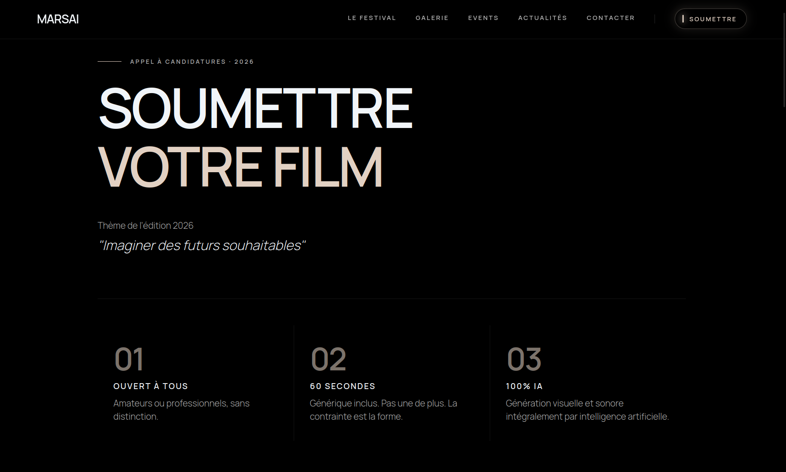
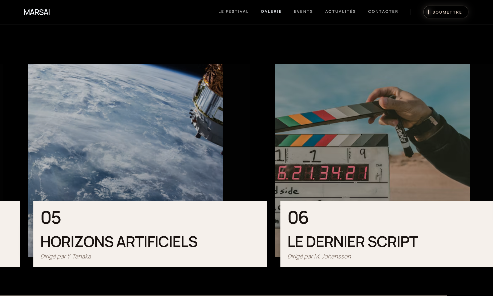
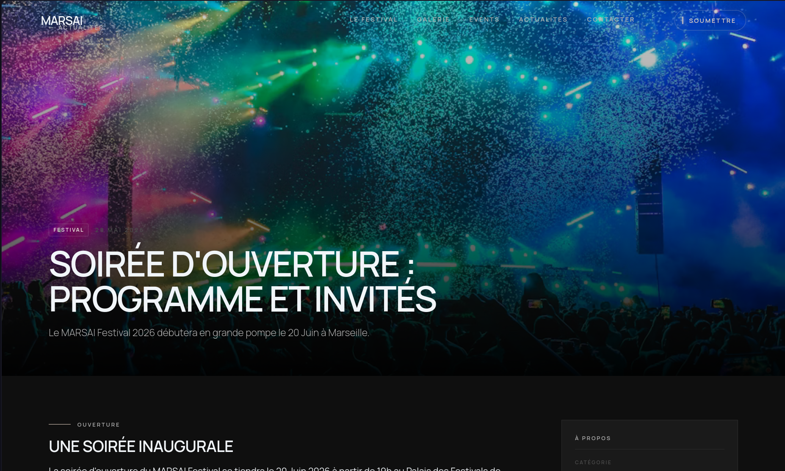

# Marsai Festival

Marsai Festival is a web platform for submitting, reviewing, and voting on AI-generated films. It provides a complete submission workflow for filmmakers, a jury review system with scoring and comments, an admin dashboard for managing the festival pipeline, and a public gallery of award-winning films.

Built as a full-stack JavaScript/TypeScript monorepo with an Express API backend and a React frontend.







## Project Structure

```
marsai-festival/
├── server/          Express REST API (Prisma + MySQL)
├── client/          React frontend (Vite + Tailwind CSS)
├── packages/
│   └── validators/  Shared Zod validation schemas
├── docker-compose.yml
└── docker-compose.prod.yml
```

## Tech Stack

- **Backend**: Express 5, Prisma 6, MySQL 8.4, JWT (argon2), Zod validation
- **Frontend**: React 19, Vite, Tailwind CSS v4, GSAP, React Router
- **Infrastructure**: Docker, Vercel (frontend + serverless backend)

## Prerequisites

- Node.js 18+
- MySQL 8.4+
- Docker & Docker Compose (optional, for containerized development)

## Setup

```bash
# Install dependencies
npm install

# Copy environment files
cp .env.example .env
cp client/.env.example client/.env
cp server/.env.example server/.env

# Configure your .env files with database URL, JWT secret, etc.

# Run database migrations
npm run prisma:migrate --workspace=server
npm run prisma:generate --workspace=server

# Create admin user
npm run create:admin --workspace=server
```

## Development

Start all workspaces in parallel:

```bash
npm run dev
```

Or individually:

```bash
npm run dev --workspace=server    # API on port 5000
npm run dev --workspace=client    # UI on port 5173
```

### Docker (Development)

```bash
docker-compose up --build
```

## Testing

```bash
npm run test                    # All tests
npm run test:coverage           # With coverage
npm run test --workspace=server # Server only
npm run test --workspace=client # Client only
```

## Build

```bash
npm run build                   # All workspaces
npm run type-check              # TypeScript validation
```

## Deployment

### Vercel

The frontend and backend deploy as separate Vercel projects.

**Frontend** (`client/`):

```bash
cd client
vercel --prod
```

Set `VITE_API_URL` to your backend's URL + `/api`.

**Backend** (`server/`):

```bash
cd server
vercel --prod
```

Set environment variables in the Vercel dashboard: `DATABASE_URL`, `JWT_SECRET`, `FRONTEND_URL`, `MAIL_HOST`, `MAIL_PORT`, `MAIL_USER`, `MAIL_PASS`.

### Docker (Production)

```bash
docker-compose -f docker-compose.prod.yml up --build
```

## Key Features

- Film submission with YouTube URL
- Jury voting with ratings and comments
- Admin workflow: review, approve, reject, request modifications, select finalists
- Award categories and winner management
- Public gallery of awarded films
- Newsletter subscription
- Site settings management
- JWT authentication with role-based access (Admin, Moderator, Jury)
- Rate limiting on auth and submission endpoints

## API Overview

| Endpoint | Description |
|----------|-------------|
| `POST /api/auth/login` | Admin login |
| `GET /api/auth/me` | Current user |
| `POST /api/films/submit` | Public film submission |
| `GET /api/films` | List films (admin) |
| `PUT /api/films/:id/status` | Change film status |
| `POST /api/jury/votes` | Cast a vote |
| `GET /api/awards/palmares` | Public award results |
| `GET /api/settings` | Site settings |
| `POST /api/newsletter/subscribe` | Newsletter signup |
| `GET /api/jury-members` | Public jury list |
